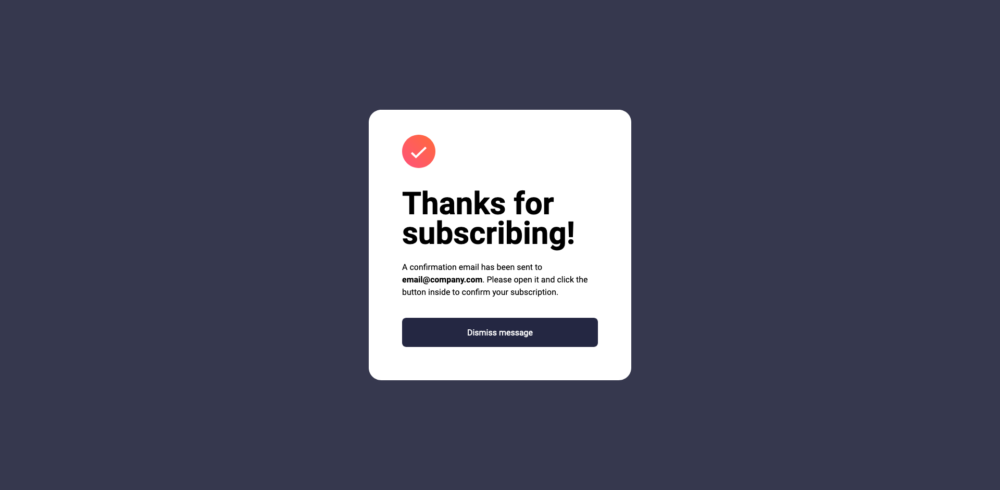
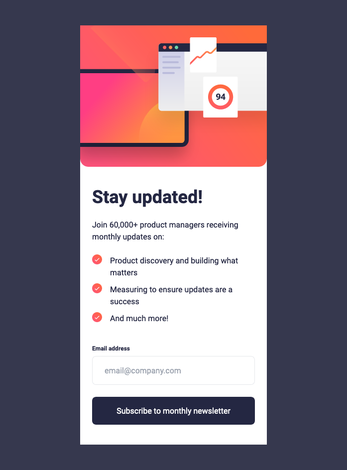
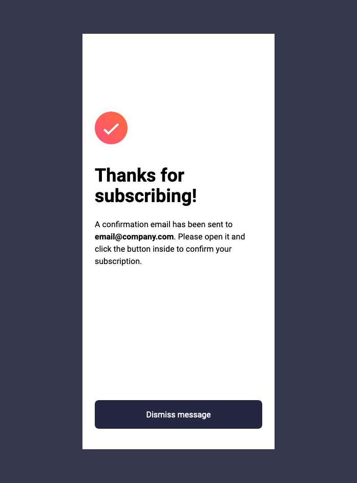

# Frontend Mentor - Newsletter sign-up form with success message solution

This is a solution to the [Newsletter sign-up form with success message challenge on Frontend Mentor](https://www.frontendmentor.io/challenges/newsletter-signup-form-with-success-message-3FC1AZbNrv). Frontend Mentor challenges help you improve your coding skills by building realistic projects.

## Table of contents

- [Frontend Mentor - Newsletter sign-up form with success message solution](#frontend-mentor---newsletter-sign-up-form-with-success-message-solution)
  - [Table of contents](#table-of-contents)
  - [Overview](#overview)
    - [The challenge](#the-challenge)
    - [Screenshots](#screenshots)
      - [Desktop:](#desktop)
      - [Mobile:](#mobile)
    - [Links](#links)
  - [My process](#my-process)
    - [Built with](#built-with)
    - [What I learned](#what-i-learned)
    - [Useful resources](#useful-resources)
  - [Author](#author)

## Overview

### The challenge

Users should be able to:

- Add their email and submit the form
- See a success message with their email after successfully submitting the form
- See form validation messages if:
  - The field is left empty
  - The email address is not formatted correctly
- View the optimal layout for the interface depending on their device's screen size
- See hover and focus states for all interactive elements on the page

### Screenshots

  
Click here

#### Desktop:

#### Mobile:

### Links

- Solution URL: [GitHub Repo](https://github.com/lazzzaroni/newsletter-sign-up-component)
- Live Site URL: [GitHub Pages](https://lazzzaroni.github.io/newsletter-sign-up-component)

## My process

### Built with

- [React](https://reactjs.org/) - JS library
- [Next.js](https://nextjs.org/) - React framework
- [Tailwind CSS](https://tailwindcss.com/) - Styles
- [React-hook-form](https://tailwindcss.com/) + [Zod](https://zod.dev/) - Form validation

### What I learned

In this project I try to use React-hook-form and Zod for handling form validation. It wasn't difficult due to only one input field, but it was interesting. 🙂

### Useful resources

- [An email regex for reasonable people](https://colinhacks.com/essays/reasonable-email-regex) - I found this article during my research on how to validate input field for email. It helps to understand how Zod validate emails.
- [React Hook Form: Schema validation using Zod](https://articles.wesionary.team/react-hook-form-schema-validation-using-zod-80d406e22cd8) - Here I found how I can make TypeScript not yelling at me during development.

## Author

- Website - [mpaliakou.dev](https://mpaliakou.dev)
- Frontend Mentor - [@lazzzaroni](https://www.frontendmentor.io/profile/lazzzaroni)
